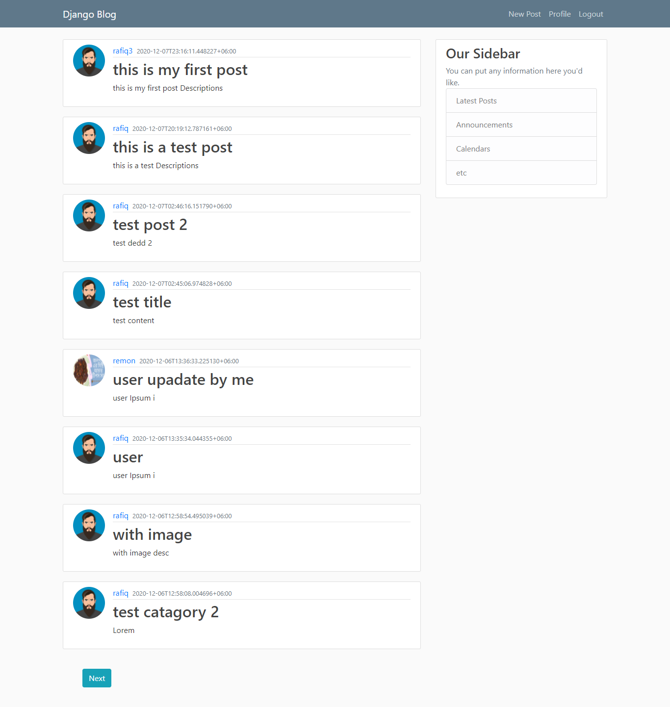
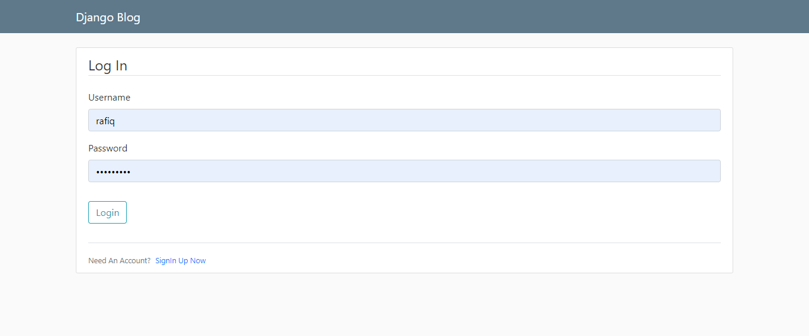
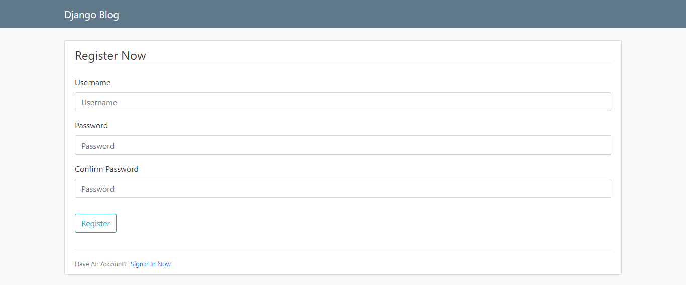
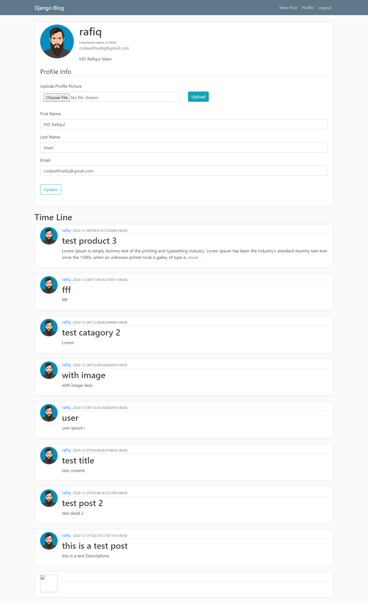
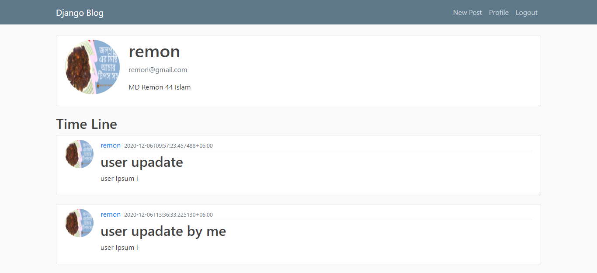

# Django React blog

## Technology use on this Project

- Django
- Django Rest Framework
- Django Auth Token 
- Django cors headers
- React js
- Axios
- React context API
- useContext Hooks
- useReducer Hooks

<p>
    <em>Home Page</em>
   
</p>

<p>
    <em>Login Page</em>
   
</p>

<p>
    <em>Register Page</em>
   
</p>

<p>
    <em>Profile Page</em>
   
</p>

<p>
    <em>Anather User Profile</em>
   
</p>


## To start

```
git clone
python -m venv venv
pip install ir requirements.txt
```

```
npm i
npm run build
```

```
python manage.py runserver
```

### Some Inportent Input

```
from rest_framework.status import HTTP_200_OK, HTTP_400_BAD_REQUEST

from  django.shortcuts import get_object_or_404

from rest_framework.status import HTTP_200_OK

from rest_framework.response import Response

from rest_framework import viewsets

from rest_framework.views import APIView

order_item, created = OrderItem.objects.get_or_create()

```

### model Chose Fild Display

```

class ItemSerializer(serializers.ModelSerializer):
    category = serializers.SerializerMethodField()
    label = serializers.SerializerMethodField()
    class Meta:
        model = Item
        fields = "__all__"
    def get_category(self,obj):
        return obj.get_category_display()
    def get_label(self,obj):
        return obj.get_label_display()

```
